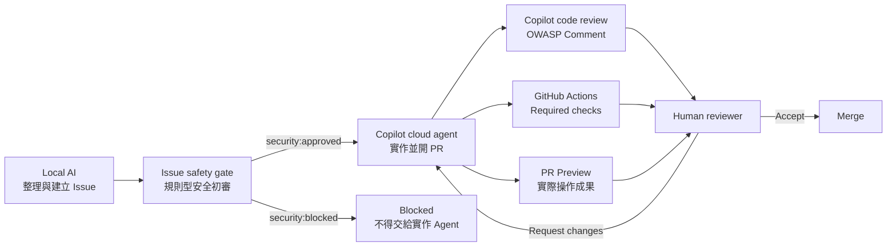

# Cloud Agent Flow Lab

這是一個真正可執行、可測試、可由 GitHub Copilot cloud agent 修改的教學型 MVP。它用同一個 repository 展示安全任務如何前進，也展示帶有 OWASP 風險的 Issue 如何被擋下。

```text
Local AI -> GitHub Issue -> Issue 安全初審 -> Copilot cloud agent -> PR
         -> Copilot code review -> Actions gate -> PR Preview -> Human decision
```

GitHub Actions 不是 cloud agent；Copilot code review 也不是人類核准。

## 十分鐘開始

### 1. 在本機執行真正的應用

需求：Node.js 20.19 以上、Python 3.9 以上、已登入的 GitHub CLI。CI 使用 Node.js 24。

```powershell
npm ci --ignore-scripts
npm run verify
npm run dev
```

開啟終端顯示的網址，在 `Cloud Agent Flow Lab` 切換「安全 Issue／不安全 Issue」，再用 Issue 安全初審表單測試 A01 與 A05。

### 2. 先看兩個 Issue 的 dry-run

```powershell
python scripts/create_demo_issue.py --scenario safe --dry-run
python scripts/create_demo_issue.py --scenario unsafe --dry-run
```

預設永遠是 dry-run。只有明確加上 `--create` 才會在 GitHub 建立 Issue。

### 3. 跑完整 GitHub Demo

先執行 Unsafe negative test，確認 `Issue Security Intake` 加上 `security:blocked` 且沒有指派 Copilot：

```powershell
python scripts/create_demo_issue.py --scenario unsafe --create
```

再建立 Safe Issue。腳本會等 `security:approved`，通過後才透過 GitHub Issue API 指派真正的 Copilot cloud agent，並選用 `implementer` custom agent：

```powershell
python scripts/create_demo_issue.py --scenario safe --create
```

Copilot 完成後會開 PR。接著要求 Copilot code review、等待 `Security Gate` 與 `PR Preview`，最後由人類決定 Request changes 或 merge。

## 可操作成果

- Vite + TypeScript 應用：[index.html](index.html)、[src/main.ts](src/main.ts)、[src/flow.ts](src/flow.ts)
- 單元測試：[src/flow.test.ts](src/flow.test.ts)、[tests/test_issue_security_gate.py](tests/test_issue_security_gate.py)
- Issue 建立腳本：[scripts/create_demo_issue.py](scripts/create_demo_issue.py)
- DOM XSS gate：[scripts/check-dangerous-dom.mjs](scripts/check-dangerous-dom.mjs)
- Custom agents：[Implementer](.github/agents/implementer.agent.md)、[OWASP Security Reviewer](.github/agents/owasp-security-reviewer.agent.md)
- PR 安全閘門：[.github/workflows/security-gate.yml](.github/workflows/security-gate.yml)
- Issue 安全初審：[.github/workflows/issue-security-intake.yml](.github/workflows/issue-security-intake.yml)
- Vite build 預覽：[.github/workflows/pr-preview.yml](.github/workflows/pr-preview.yml)
- OWASP 檢核：[checklist](docs/security/owasp-top-10-2025-checklist.md)、[control matrix](docs/security/owasp-control-matrix.md)

## 完整教學

- [教學入口](docs/tutorial/README.md)
- [完整架構](docs/tutorial/architecture.md)
- [如何建立合格 Issue](docs/tutorial/create-issue.md)
- [如何指派與查看 Cloud Agent](docs/tutorial/cloud-agent.md)
- [如何執行 AI／OWASP 審查](docs/tutorial/ai-security-review.md)
- [如何進行人類 PR 審查](docs/tutorial/human-pr-review.md)
- [Safe／Unsafe Demo 腳本](docs/tutorial/demo-script.md)
- [目前完成度與限制](docs/tutorial/current-status.md)

## 人類實際要做什麼

本地端 AI、Copilot cloud agent 與 GitHub Actions 會完成大部分技術工作；人類保留三個不同層次的決定：

1. `Approve workflows to run`：只允許 GitHub 執行測試，不代表接受程式碼，也不會修改 `main`。
2. `Approve`：表示人類已完成 PR 審查，但程式碼仍未進入 `main`。
3. `Merge`：接受這次修改並放入 `main`，是最後且真正會改變正式版本的動作。

實際操作前先閱讀[人類 PR 審查](docs/tutorial/human-pr-review.md)。Copilot review 與綠色 checks 都是證據，不會取代人類的 Merge 決定。

## 角色分工



## 現有 GitHub 證據

- Unsafe Issue：[Issue #10](https://github.com/IISI-2112007/ai-coding-solved-demo/issues/10)，具有 `security:blocked`、A01／A05 與 `BLOCK` 證據。
- Unsafe PR：[PR #11](https://github.com/IISI-2112007/ai-coding-solved-demo/pull/11)，Copilot code review 與 Actions 均指出問題，禁止合併。
- Safe Issue：[Issue #12](https://github.com/IISI-2112007/ai-coding-solved-demo/issues/12)，由真正 Copilot cloud agent 接手。
- Safe PR：[PR #13](https://github.com/IISI-2112007/ai-coding-solved-demo/pull/13)，由 Copilot 實作，checks 全數通過並由人類核准、合併。
- Safe Preview：[PR #13 Preview](https://iisi-2112007.github.io/ai-coding-solved-demo/pr-13/)，已驗證 HTTP 200。
- Workflow 修正：[PR #14](https://github.com/IISI-2112007/ai-coding-solved-demo/pull/14)，修正 Issue 安全標籤重跑一致性並由人類合併。

## 歷史 Simulator

`.github/workflows/cloud-agent-simulator.yml` 與 `scripts/create_agent_issue.py` 是第一版歷史教學，用來說明 Issue／Actions／PR 骨架。它不是 Cloud Agent，也不再是主要 Demo 路徑。

## 安全與 MVP 邊界

- OWASP Top 10 是風險 awareness 基準，不是認證。
- Copilot code review 只留下 Comment，不會阻擋 merge。
- Public repository 目前不能使用 Copilot Automations，因此不假裝兩個 agents 能自動可信接力。
- 不自動 merge；人類保留最後決定。
- Preview 是 PR 成果畫面，不是 production deployment。

## 官方參考

- [Using Copilot cloud agent on GitHub](https://docs.github.com/en/copilot/how-tos/use-copilot-agents/cloud-agent/use-cloud-agent-on-github)
- [Creating custom agents](https://docs.github.com/en/copilot/how-tos/copilot-on-github/customize-copilot/customize-cloud-agent/create-custom-agents)
- [Using GitHub Copilot code review](https://docs.github.com/en/copilot/how-tos/copilot-on-github/use-copilot-agents/copilot-code-review)
- [Dependency review action](https://docs.github.com/en/code-security/how-tos/secure-your-supply-chain/manage-your-dependency-security/configure-dependency-review-action)
- [OWASP Top 10:2025](https://owasp.org/Top10/)
