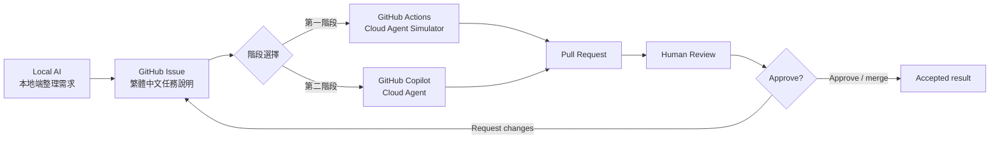

# Local AI To Cloud Agent MVP

這個專案是一個 GitHub workflow demo，目標是展示一條最小可行流程：

```text
本地端 AI -> GitHub Issue -> Cloud Agent -> Pull Request -> Human Review
```

第一階段先用 GitHub Actions 模擬 cloud agent，證明 Issue、Actions、PR 與人類審查節點都能跑通。第二階段改成真正的 GitHub Copilot cloud agent：由本地端 AI 建立繁體中文 Issue，指派給 Copilot cloud agent，完成後開 PR 給人類審查。

## 目前成果

- 本地端腳本可以建立第一階段 simulator Issue：[scripts/create_agent_issue.py](scripts/create_agent_issue.py)
- 第二階段腳本可以建立要交給 Copilot cloud agent 的 Issue：[scripts/create_copilot_issue.py](scripts/create_copilot_issue.py)
- 第一階段 Issue template：[.github/ISSUE_TEMPLATE/agent-task.yml](.github/ISSUE_TEMPLATE/agent-task.yml)
- 第二階段 Copilot Issue template：[.github/ISSUE_TEMPLATE/copilot-agent-task.yml](.github/ISSUE_TEMPLATE/copilot-agent-task.yml)
- GitHub Actions simulator：[.github/workflows/cloud-agent-simulator.yml](.github/workflows/cloud-agent-simulator.yml)
- Cloud Agent Simulator 產出器：[scripts/cloud_agent_simulator.py](scripts/cloud_agent_simulator.py)
- 第二階段 runbook：[docs/phase-2-copilot-cloud-agent.md](docs/phase-2-copilot-cloud-agent.md)
- 實務操作流程：[docs/operation-flow.md](docs/operation-flow.md)
- Demo 頁面：[index.html](index.html)

## 流程圖



## 第一階段：Simulator

第一階段不使用真正 LLM agent，而是用 GitHub Actions 模擬 cloud agent。它的價值是先把 GitHub 上的任務交接骨架跑通。

```powershell
python scripts/create_agent_issue.py
```

這會建立帶有 `local-ai` 與 `cloud-agent:ready` label 的 Issue。GitHub Actions 看到 `cloud-agent:ready` 後會產生 branch、輸出文件、PR，並把 PR 連結留言回 Issue。

## 第二階段：Copilot Cloud Agent

第二階段改走真正的 GitHub Copilot cloud agent。先 dry-run 看即將上傳的繁體中文 Issue 內容：

```powershell
python scripts/create_copilot_issue.py --repo IISI-2112007/ai-coding-solved-demo --dry-run
```

確認後才建立 Issue 並指派給 Copilot cloud agent：

```powershell
python scripts/create_copilot_issue.py --repo IISI-2112007/ai-coding-solved-demo --create
```

這條路線會使用 `copilot-cloud-agent:ready` label，不會使用 `cloud-agent:ready`，因此不會觸發第一階段 simulator workflow。

## 語言政策

之後上傳到 GitHub 的 Issue 說明、PR 說明、agent 產出文件與 runbook，預設都使用繁體中文。英文僅保留在工具名稱、GitHub label、CLI 指令、檔名與官方產品名中。

## 官方參考

- [Starting Copilot sessions](https://docs.github.com/en/copilot/how-tos/use-copilot-agents/cloud-agent/start-copilot-sessions)
- [Using Copilot cloud agent on GitHub](https://docs.github.com/en/copilot/how-tos/use-copilot-agents/cloud-agent/use-agent-on-github)
- [Using Copilot cloud agent from GitHub CLI](https://docs.github.com/en/copilot/how-tos/use-copilot-agents/cloud-agent/use-agent-from-github-cli)

## 本地驗證

```powershell
python scripts/verify_mvp.py
python scripts/create_agent_issue.py --dry-run
python scripts/create_copilot_issue.py --repo IISI-2112007/ai-coding-solved-demo --dry-run
node --check assets\app.js
```

## Demo 講法

1. 打開 `index.html`，說明整體流程。
2. 展示第一階段：本地端 AI 建立 Issue，GitHub Actions simulator 開 PR。
3. 展示第二階段：本地端 AI 建立繁體中文 Issue，指派給 Copilot cloud agent。
4. 到 GitHub 看 Issue、agent session 或 PR。
5. 以人類 reviewer 身分檢查 diff，決定 approve 或 request changes。

## MVP 邊界

- 不自動 merge。
- 不跳過人類 review。
- 第一階段 simulator 不等於真正 cloud agent。
- 第二階段是否能啟動 Copilot cloud agent，取決於 GitHub 帳號、Copilot 方案、repo 設定與 GitHub 當前功能開放狀態。
