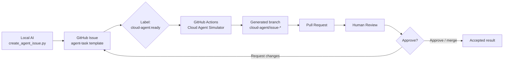

# Local AI To Cloud Agent MVP

這個專案是一個 GitHub workflow demo。它展示一條最小可行流程：

```text
本地端 AI -> GitHub Issue -> GitHub Actions Cloud Agent Simulator -> Pull Request -> Human Review
```

第一版不先追求真正全自動 AI agent，而是用 GitHub Actions 模擬 cloud agent。這樣可以先證明流程、權限、審查節點與 GitHub 上的可追蹤證據都跑得通。

## MVP 最後成果

- 本地端腳本可以建立 GitHub Issue：[scripts/create_agent_issue.py](scripts/create_agent_issue.py)
- Issue template 會固定任務格式：[.github/ISSUE_TEMPLATE/agent-task.yml](.github/ISSUE_TEMPLATE/agent-task.yml)
- GitHub Actions 會在 issue 標上 `cloud-agent:ready` 時接手：[.github/workflows/cloud-agent-simulator.yml](.github/workflows/cloud-agent-simulator.yml)
- Cloud Agent Simulator 會產生 reviewable output：[scripts/cloud_agent_simulator.py](scripts/cloud_agent_simulator.py)
- Workflow 會開 Pull Request 給人類審查。
- Demo 頁面：[index.html](index.html)
- 實務操作流程：[docs/operation-flow.md](docs/operation-flow.md)

## 實務流程圖



## 怎麼操作

### 1. 先確認 GitHub CLI 登入

```powershell
& 'C:\Program Files\GitHub CLI\gh.exe' auth status
```

### 2. 建立 GitHub repo 並 push

這一步只需要做一次。若 repo 還不存在，用：

```powershell
& 'C:\Program Files\GitHub CLI\gh.exe' repo create ai-coding-solved-demo --private --source . --remote origin --push
```

若 repo 已存在，只要確認 `origin` remote 和 push。

### 3. 本地端 AI 發 issue

在 repo 已經 push 到 GitHub 後執行：

```powershell
python scripts/create_agent_issue.py
```

這會建立一個 issue，並加上：

- `local-ai`
- `cloud-agent:ready`

### 4. Cloud Agent Simulator 自動接手

GitHub Actions 看到 `cloud-agent:ready` 後會：

1. 建立 `cloud-agent/issue-*` branch。
2. 產生 `cloud-agent-output/issue-*/summary.md`。
3. 更新 `DEMO_RESULTS.md`。
4. 開一個 Pull Request。
5. 在 issue 留言貼上 PR 連結。

### 5. 人類審查

人在 GitHub PR 頁面檢查：

- PR 是否連回原 issue。
- 改動是否在 allowed scope。
- 產出是否看得懂。
- 要 approve、request changes，或 close。

## 本地驗證

```powershell
python scripts/verify_mvp.py
python _codex\work\20260706-demo-project\verify_demo.py
node --check assets\app.js
```

## Demo 講法

1. 先開 `index.html`，說明整體流程。
2. 展示 GitHub issue template。
3. 執行 `python scripts/create_agent_issue.py`。
4. 到 GitHub 看 issue 與 Actions run。
5. 打開自動建立的 PR。
6. 以人類 reviewer 身分看 diff 和 checklist。

## MVP 邊界

這一版的 cloud agent 是 simulator，不是真正 LLM agent。它的價值是先把 GitHub 上的流程跑通：

- 任務由 issue 進入。
- 雲端自動化可接手。
- 成果以 PR 呈現。
- 人類保留最後審查權。

下一版可以把 `scripts/cloud_agent_simulator.py` 換成真正的 cloud LLM agent，但 GitHub workflow 和人類審查骨架不需要重做。
