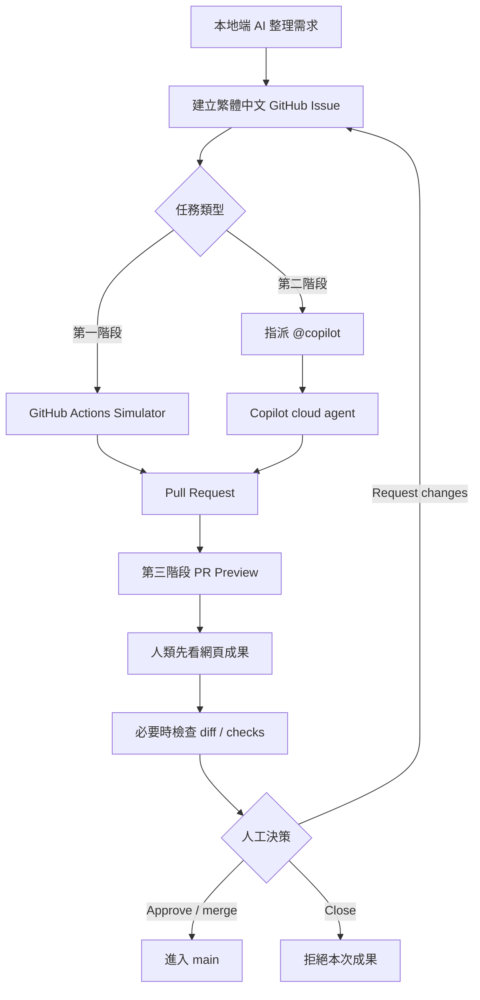

# End-to-End 流程總覽

## 這份文件解決什麼問題

這份文件把目前對話中釐清過的內容收斂成一條完整路線。它不是只有三個階段，而是從 project 初始化、本地端 AI、GitHub Issue、cloud agent、preview、資安 gate 到人類審查的整體工作流。

## 核心觀念

Issue 不是單純待辦事項，而是任務交接契約。它要保存目標、背景、允許修改範圍、驗收標準與人工審查要求。

Cloud agent 不會因為任何 Issue 出現就自動工作。這次實測成功的觸發方式是：

```text
Issue + 指派 @copilot -> Copilot cloud agent 開始工作
```

PR 是 agent 交付成果的容器。PR 裡有 diff、討論、checks、deployment、preview URL 與最後的人類決策。

Preview URL 是給人先看成果，不是用來取代 diff。它讓 PM、主管或非工程 reviewer 能先看畫面；工程 reviewer 仍可回到 PR 檢查 diff。

## 現在已完成的路線



## 階段說明

### Phase 0：Project / GitHub repo

目的：讓本地資料夾成為可被 GitHub 追蹤的 demo repo。

目前狀態：

- repo 已建立並 push 到 GitHub。
- `main` 是目前主線。
- GitHub CLI 已可用。

### Phase 1：Cloud Agent Simulator

目的：先證明 GitHub 上的交接骨架能跑通。

流程：

```text
本地端 AI -> Issue + cloud-agent:ready -> GitHub Actions -> PR -> Human Review
```

這不是真正 LLM cloud agent。它是 simulator，用來先驗證 Issue、workflow、branch、PR、review checkpoint。

### Phase 2：真正 Copilot Cloud Agent

目的：改由 GitHub Copilot cloud agent 接手。

流程：

```text
本地端 AI -> Issue + @copilot -> Copilot cloud agent -> PR -> Human Review
```

這次已實測：

- Issue #3 已建立。
- Copilot cloud agent 已開 PR #4。
- `gh agent-task list` 顯示 Ready for review。

### Phase 3：PR Preview Deployment

目的：讓人類不只看程式碼 diff，也可以先看網頁成果。

流程：

```text
PR -> GitHub Actions -> gh-pages/pr-{PR_NUMBER}/ -> Preview URL -> Human Review
```

這一階段的重點是 reviewer 不需要拉 local，也不需要先懂 diff，就能從 PR comment 點 preview URL。

目前狀態：owner 已將 repo 改為 public，GitHub Pages 已啟用。PR #4 preview URL 已實測 HTTP 200，可直接在瀏覽器打開。

Provider 決策請見：[PR Preview Provider 決策紀錄](preview-provider-decision.md)。

### Phase 4：資安與品質 gate

目的：讓 PR 進入人類審查前，先有機器或 AI reviewer 檢查。

建議路線：

```text
Copilot cloud agent 實作
  -> PR Preview
  -> GitHub Actions quality checks
  -> CodeQL / dependency review / secret scanning
  -> 可選 Copilot Code Review
  -> Human Review
```

注意：Copilot Code Review 可以提供 AI review comment，但不應該被當成唯一安全 gate。可靠 gate 應該由 GitHub Actions required checks、branch protection 或 environment protection 承擔。

## 多 agent 分工的設計方向

你提出的方向是：

```text
Cloud Agent 1：編寫
Cloud Agent 2：資安檢查
通過後才到人類手上
```

在 GitHub 上比較穩的落地方式是：

```text
Copilot coding agent -> PR
Security workflow -> status check
Optional AI review -> PR comment
Human reviewer -> final decision
```

如果之後要做 custom agents，可以把 `.github/agents/` 加進 repo，用不同 agent description 區分「實作型 agent」與「review 型 agent」。但真正阻擋 merge 的 gate 仍應該由 required status checks 管控。

## 人類 reviewer 看什麼

建議順序：

1. Issue：確認原始需求與允許修改範圍。
2. PR preview：先看成果畫面。
3. PR body：看 agent 自己交代做了什麼。
4. Files changed：必要時看 diff。
5. Checks：看 preview、test、security gate 是否通過。
6. 決策：approve、request changes 或 close。

## 不建議的做法

- 不要讓任何 Issue 都自動交給 cloud agent。
- 不要讓 cloud agent 直接 merge。
- 不要只靠 AI review 當資安 gate。
- 不要讓 fork PR 直接取得可以寫入 `gh-pages` 的 token。
- 不要把 simulator 說成真正 cloud agent。

## 最終目標形狀

理想完整流程是：

```text
本地端 AI 或人類建立 Issue
  -> 明確 label / assignment 決定是否啟動 cloud agent
  -> Copilot cloud agent 完成工作並開 PR
  -> PR 自動產生 preview URL
  -> 自動化品質與資安 gate
  -> 人類用 preview + diff + checks 做最後審查
  -> merge 後才進入 main / production
```

若未來 repo 改回 private，需要重新檢查 Pages 方案或改接外部 preview provider。
