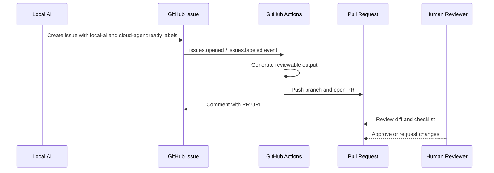

# MVP 實務操作流程

## 目的

建立一個 GitHub 上可 demo 的最小流程：

```text
本地端 AI 開 issue -> Cloud Agent Simulator 接手 -> 開 PR -> 人類 review
```

這份文件是 demo runbook。照著做，可以從本地端發動任務，然後在 GitHub 上看到 issue、workflow run、branch、PR 與 review checkpoint。

## 角色

| 角色 | 責任 |
| --- | --- |
| Local AI | 在本地端整理需求，透過 `scripts/create_agent_issue.py` 建立 GitHub Issue。 |
| GitHub Issue | 作為任務入口，保存 goal、context、allowed scope、acceptance criteria。 |
| Cloud Agent Simulator | 由 GitHub Actions 執行，模擬雲端 agent 完成一個小成果。 |
| Pull Request | 保存 cloud agent 的成果與 diff，交給人類審查。 |
| Human Reviewer | 檢查 PR 是否符合 issue 與 allowed scope，再 approve 或 request changes。 |

## 流程圖



## Step 1：確認工具

```powershell
git status --short --branch
& 'C:\Program Files\GitHub CLI\gh.exe' auth status
python scripts/verify_mvp.py
```

期待結果：

- GitHub CLI 登入 `github.com`。
- `verify_mvp.py` 通過。
- working tree 變更都屬於這個 MVP。

## Step 2：發布 repo

第一次發布建議先用 private repo：

```powershell
& 'C:\Program Files\GitHub CLI\gh.exe' repo create ai-coding-solved-demo --private --source . --remote origin --push
```

如果 remote 已存在：

```powershell
git remote -v
git push -u origin main
```

## Step 3：本地端 AI 建立 issue

```powershell
python scripts/create_agent_issue.py
```

這個腳本會：

1. 確認 `gh auth status`。
2. 確認 labels `local-ai` 和 `cloud-agent:ready` 存在。
3. 建立一個 GitHub issue。
4. 讓 issue 帶上 `cloud-agent:ready`，觸發 GitHub Actions。

## Step 4：Cloud Agent Simulator 接手

GitHub Actions workflow：

```text
.github/workflows/cloud-agent-simulator.yml
```

它會：

- 建立 `cloud-agent/issue-{number}-{run_id}` branch。
- 執行 `scripts/cloud_agent_simulator.py`。
- 產生 `cloud-agent-output/issue-{number}/summary.md`。
- 產生 `DEMO_RESULTS.md`。
- 開 PR。
- 回到 issue 留 comment。

## Step 5：人類審查

人在 PR 頁面看：

- `cloud-agent-output/issue-*/summary.md`
- `DEMO_RESULTS.md`
- PR body 的 checklist
- Issue link

決策：

- `Approve`：接受 cloud agent 成果。
- `Request changes`：要求 cloud agent 或本地 AI 修正。
- `Close PR`：拒絕這次成果。

## 驗收標準

- GitHub repo 存在。
- Issue template 可用。
- 本地腳本能建立 issue。
- Issue 觸發 GitHub Actions。
- GitHub Actions 產生 branch。
- GitHub Actions 開 PR。
- 人類可以在 PR 頁面審查。

## 這個 MVP 不做什麼

- 不直接接真正 LLM cloud agent。
- 不自動 merge。
- 不跳過人類 review。
- 不讓本地 AI 直接 push cloud-agent 成果。

這些保留到下一階段，先把 GitHub 上的任務交接與審查流程跑通。
