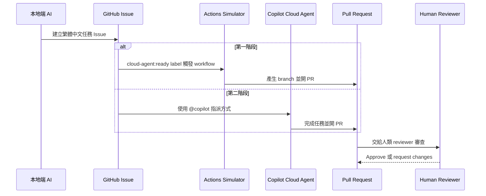

# MVP 實務操作流程

## 目的

建立一個 GitHub 上可 demo 的最小流程：

```text
本地端 AI 開 Issue -> Cloud Agent 接手 -> 開 PR -> 人類 review
```

這份文件是 demo runbook。照著做，可以從本地端發動任務，然後在 GitHub 上看到 Issue、workflow run、branch、PR 與 review checkpoint。

## 角色

- 本地端 AI：整理需求，透過腳本建立 GitHub Issue。
- GitHub Issue：作為任務入口，保存目標、背景、允許修改範圍與驗收標準。
- Cloud Agent Simulator：第一階段使用 GitHub Actions 模擬雲端 agent。
- GitHub Copilot cloud agent：第二階段真正接手 Issue，完成後開 PR。
- Pull Request：保存 agent 成果與 diff，交給人類審查。
- Human Reviewer：檢查 PR 是否符合 Issue 與允許範圍，再 approve 或 request changes。

## 流程圖



## Step 1：確認工具

```powershell
git status --short --branch
& 'C:\Program Files\GitHub CLI\gh.exe' auth status
python scripts/verify_mvp.py
```

期待結果：

- GitHub CLI 已登入 `github.com`。
- `verify_mvp.py` 通過。
- working tree 變更都屬於這個 MVP。

## Step 2：發布 repo

第一次發布建議先用 private repo：

```powershell
& 'C:\Program Files\GitHub CLI\gh.exe' repo create ai-coding-solved-demo --private --source . --remote origin --push
```

如果 remote 已存在：

```powershell
git remote -v
git push -u origin main
```

接著確認 repo 的 Actions workflow 權限。第一階段 simulator 需要開 branch 和 PR：

```powershell
& 'C:\Program Files\GitHub CLI\gh.exe' api repos/IISI-2112007/ai-coding-solved-demo/actions/permissions/workflow
```

期待：

```json
{
  "default_workflow_permissions": "write",
  "can_approve_pull_request_reviews": true
}
```

若不是這個狀態，由 repo owner 執行：

```powershell
& 'C:\Program Files\GitHub CLI\gh.exe' api -X PUT repos/IISI-2112007/ai-coding-solved-demo/actions/permissions/workflow -f default_workflow_permissions=write -F can_approve_pull_request_reviews=true
```

## Step 3：第一階段 simulator

```powershell
python scripts/create_agent_issue.py
```

這個腳本會：

1. 確認 `gh auth status`。
2. 確認 labels `local-ai` 和 `cloud-agent:ready` 存在。
3. 建立一個繁體中文 GitHub Issue。
4. 讓 Issue 帶上 `cloud-agent:ready`，觸發 GitHub Actions。

GitHub Actions workflow：

```text
.github/workflows/cloud-agent-simulator.yml
```

它會：

- 建立 `cloud-agent/issue-{number}-{run_id}` branch。
- 執行 `scripts/cloud_agent_simulator.py`。
- 產生 `cloud-agent-output/issue-{number}/summary.md`。
- 產生 `DEMO_RESULTS.md`。
- 開 PR。
- 回到 Issue 留 comment。

## Step 4：第二階段 Copilot cloud agent

先確認即將上傳的 Issue 內容：

```powershell
python scripts/create_copilot_issue.py --repo IISI-2112007/ai-coding-solved-demo --dry-run
```

確認後建立 Issue 並指派 Copilot cloud agent：

```powershell
python scripts/create_copilot_issue.py --repo IISI-2112007/ai-coding-solved-demo --create
```

第二階段 Issue 會帶上：

- `local-ai`
- `copilot-cloud-agent:ready`
- `phase-2`

它不會帶上 `cloud-agent:ready`，因此不會觸發第一階段 simulator。

## Step 5：人類審查

人在 PR 頁面看：

- PR 說明是否連回原始 Issue。
- diff 是否只修改允許範圍內的檔案。
- agent 產出是否使用繁體中文。
- reviewer 是否能清楚決定 approve、request changes 或 close PR。

## 驗收標準

- GitHub repo 存在。
- Issue template 可用。
- 本地腳本能建立第一階段 simulator Issue。
- 第一階段 Issue 能觸發 GitHub Actions 並產生 PR。
- 第二階段腳本能產生繁體中文 Copilot Issue。
- 第二階段 Issue 可用 `@copilot` 指派方式交給 Copilot cloud agent。
- 人類可以在 PR 頁面審查。

## 這個 MVP 不做什麼

- 不自動 merge。
- 不跳過人類 review。
- 不讓本地 AI 直接 push agent 成果。
- 不把第一階段 simulator 說成真正 cloud agent。
