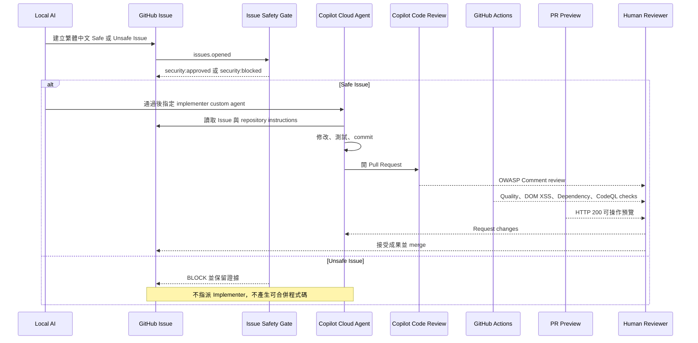

# 完整架構

## 主流程

## 為何不是兩個 Agent 自動核准

GitHub custom agents 可以在 Issue 指派時選擇，但 GitHub.com 目前不支援 agent profile 的 `handoffs`。Copilot code review 固定留下 Comment，不能形成 required approval。

因此真正的責任分工是：

- Implementer custom agent：實作。
- OWASP Security Reviewer custom agent：唯讀分析或示範用專家角色。
- Copilot code review：PR 上的 AI review。
- GitHub Actions：可重現的 enforcement。
- Human reviewer：最後決定。

## 信任邊界

- Issue 文字是輸入，不因為來自 AI 就可信。
- Copilot 產生的程式仍需按一般 PR 檢查。
- AI review 是建議，不是 required approval。
- Actions 綠燈只能證明已執行的檢核，不代表完整 OWASP 合規。
- Preview 只能證明該 PR head 的畫面可操作，不代表 production 安全。
